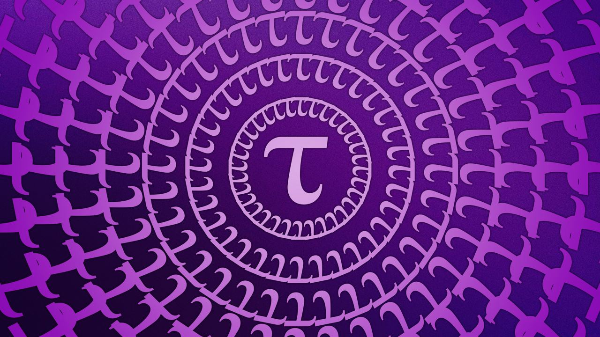

# EVM Public Powers-Of-Tau Ceremony

Trusted setup ceremonies generate trustworthy cryptographic keys for securing crypto wallets, blockchain protocols and zero-knowledge proof systems. The ceremony is frequently the root of trust for a given protocol's security, and they are therefore extremely important to get right. Existing strategies involve Multi-Party Computation or a centralized server. These have problems in the form of censorship, verifiablity, and auditability. This repo lays out a strategy for using a public (EVM-based) blockchain for orchestrating the ceremony for the BN254 curve.

The core smart contract can be found in `contracts/KZG.sol`. After deploying this contract, anyone can call `kzg.potUpdate()` with a set of update parameters. The validity of their parameters will be verified on-chain and the call will be reverted in the case of poor parameters. Given the powers-of-tau ceremony requires a 1-of-n honest party trust assumption, if any user honestly performs the ceremony (generating their randomness, submitting and update, and destroying their randomness without leakage), we can be sure that the resulting parameters are secure for usage in other cryptographic systems.

A local end-to-end test of several updates can be found in `tests/integration_test.srs`.

Cryptographic details can be found in `techreport/main.pdf`.

## Usage
- Build: `cargo build`
- Test: `cargo test`

## Build notes 
- Solidity tests require Solc
- Solc 8.16.0 requires z3 on M1 macs: `brew install z3`
- Gas usage during tests: `cargo test -- --nocapture`

## Credits
- Underlying crypto uses [arkworks-rs](https://github.com/arkworks-rs). Usage info found [here](https://github.com/Pratyush/algebra-intro)
- Solidity library for interacting with EC precompiles is based on [Keep network's](https://github.com/keep-network/keep-core/)

## Disclaimer
*These smart contracts are being provided as is. No guarantee, representation or warranty is being made, express or implied, as to the safety or correctness of the user interface or the smart contracts. They have not been audited and as such there can be no assurance they will work as intended, and users may experience delays, failures, errors, omissions or loss of transmitted information. THE SMART CONTRACTS CONTAINED HEREIN ARE FURNISHED AS IS, WHERE IS, WITH ALL FAULTS AND WITHOUT WARRANTY OF ANY KIND, EXPRESS OR IMPLIED, INCLUDING ANY WARRANTY OF MERCHANTABILITY, NON- INFRINGEMENT OR FITNESS FOR ANY PARTICULAR PURPOSE. Further, use of any of these smart contracts may be restricted or prohibited under applicable law, including securities laws, and it is therefore strongly advised for you to contact a reputable attorney in any jurisdiction where these smart contracts may be accessible for any questions or concerns with respect thereto. Further, no information provided in this repo should be construed as investment advice or legal advice for any particular facts or circumstances, and is not meant to replace competent counsel. a16z is not liable for any use of the foregoing, and users should proceed with caution and use at their own risk. See a16z.com/disclosures for more info.*
